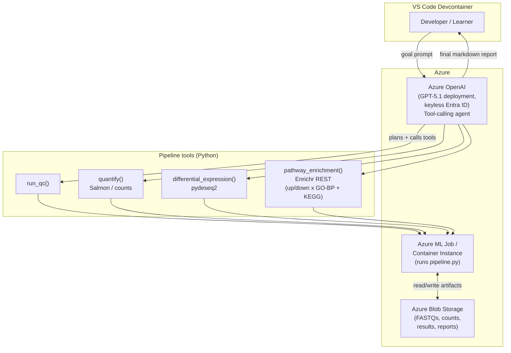

# Scenario 01 — Autonomous Bioinformatics Pipeline Assistant

An LLM agent (Azure OpenAI) that **orchestrates an RNA-seq differential-expression
pipeline** and explains each decision it makes along the way.

The agent plans and drives four stages using the real Azure OpenAI **tool-calling**
loop:

```
QC  →  Quantification (filter)  →  Differential Expression (pydeseq2)  →  Pathway Enrichment (Enrichr REST: up/down × GO-BP + KEGG)
```

Everything Python-only: differential expression uses **pydeseq2** (no R required);
pathway enrichment calls the **Enrichr REST API** directly (no gseapy) — the
significant genes are split into **up-** and **down-regulated** sets and each is
tested against **GO Biological Process** *and* **KEGG**. Drosophila (FlyBase
`FBgn`) genes are auto-mapped to symbols via **mygene.info** and routed to
**FlyEnrichr**. The lab ships with a synthetic counts matrix fallback so it runs
end-to-end even with no internet.

**Learner stack:** Azure + GitHub + VS Code (devcontainer). The agent runs on any
tool-calling Azure OpenAI deployment (validated on **GPT-5.1**) and supports
**keyless Microsoft Entra ID** auth (no API key required).

---

## Architecture



The agent (`src/agent.py`) holds the reasoning loop. The deterministic analysis
lives in `src/pipeline.py`. The agent never invents results — each tool actually
runs the corresponding analysis function and returns real numbers back into the
model's context.

---

## Repository layout

```
scenario-01-pipeline-automation/
├── README.md
├── requirements.txt
├── .env.example
├── .devcontainer/
│   └── devcontainer.json
├── .github/workflows/
│   └── ci.yml
├── infra/
│   └── azure-setup.md
├── scripts/
│   └── download_data.py
├── src/
│   ├── agent.py          # Azure OpenAI tool-calling orchestrator (keyless-capable)
│   └── pipeline.py       # QC + pydeseq2 DE + Enrichr-REST enrichment
└── data/                 # created by scripts/download_data.py
```

---

## Prerequisites

- An **Azure subscription**.
- An **Azure OpenAI** (or Azure AI Foundry) resource with a tool-calling chat
  deployment — validated on **GPT-5.1** (any GPT-4o/4.1/5.x works). Note the
  **endpoint** and **deployment name**. Auth can be **keyless** (Microsoft Entra
  ID via `az login`) or an API key.
- (Optional) An **Azure Storage** account for staging FASTQs / results.
- **Python 3.11**.
- **VS Code** with the **Dev Containers** extension.
- **Docker** (Docker Desktop or engine) to build/run the devcontainer.

---

## Step-by-step run guide

1. **Clone the repo**

   ```bash
   git clone <your-fork-url>
   cd scenario-01-pipeline-automation
   ```

2. **Open in the devcontainer.** In VS Code: `F1` → *Dev Containers: Reopen in
   Container*. This builds the Python 3.11 image and installs `requirements.txt`
   automatically (see `.devcontainer/devcontainer.json`).

3. **Configure access.** Copy the template and fill in your Azure values:

   ```bash
   cp .env.example .env
   # edit .env: AZURE_OPENAI_ENDPOINT, AZURE_OPENAI_DEPLOYMENT, AZURE_OPENAI_API_VERSION
   ```

   **Keyless (recommended):** leave `AZURE_OPENAI_API_KEY` unset and run `az login`
   — the agent uses your Entra ID token (`DefaultAzureCredential`). Otherwise set
   `AZURE_OPENAI_API_KEY`. `.env` is git-ignored; never commit secrets.

4. **Choose the data.** Run the downloader — it **prompts you for the URL of an
   RNA-seq counts file** to analyse:

   ```bash
   python scripts/download_data.py
   ```

   - **Press Enter with no input** to use the default **pasilla** dataset — a
     classic *Drosophila* RNA-seq experiment (~14,599 genes; 7 samples: 3 pasilla
     splicing-factor knockdown *treated* vs 4 *untreated* controls).
   - **Paste a URL** to a gene-level counts table (TSV or CSV; gene id in column 1,
     one integer-count column per sample) to analyse your own data. Sample
     condition is inferred from column names by stripping the trailing replicate
     number (`treated1`/`treated2` → `treated`), so name columns `<group><replicate>`.

   Non-interactive equivalents:

   ```bash
   python scripts/download_data.py --url <URL>        # specific file, no prompt
   python scripts/download_data.py --synthetic-only   # offline synthetic set (CI)
   ```

   Outputs land in `data/` (`counts.csv`, `coldata.csv`). If a download fails the
   script falls back to pasilla, then to a synthetic set, so the lab always runs.

5. **Run the agent.** The agent plans the run, calls each pipeline tool, prints
   its reasoning, and emits a final markdown report:

   ```bash
   python src/agent.py
   ```

   To run the deterministic pipeline directly (no LLM), for debugging:

   ```bash
   python src/pipeline.py
   ```

6. **Inspect outputs.** Results are written to `data/results/`:
   - `qc_summary.json` — library sizes, gene/sample counts, low-count flags.
   - `de_results.csv` — pydeseq2 differential-expression table (log2FC, padj).
   - `enrichment.csv` — Enrichr pathway terms (columns `Direction`, `Database`) for
     up/down-regulated genes across GO Biological Process **and** KEGG.
   - `report.md` — the agent's final narrative report (UTF-8).

---

## Tech stack

- **Analysis:** pydeseq2 (DESeq2 in pure Python), pandas / numpy.
- **Enrichment:** Enrichr REST API (`/addList` + `/enrich`) — no gseapy; mygene.info
  for FlyBase→symbol mapping; FlyEnrichr for *Drosophila*; **up/down split × GO
  Biological Process + KEGG**.
- **Agent:** Azure OpenAI tool-calling (validated on **GPT-5.1**); keyless
  Microsoft Entra ID auth (`azure-identity`) or API key; supports the classic and
  `/openai/v1` endpoints; UTF-8 report output.
- **Data:** interactive URL prompt (default: pasilla) via `scripts/download_data.py`.
- **Env:** Python 3.11, VS Code Dev Containers; CI lints + smoke-imports only.

## Notes

- The agent needs Azure OpenAI access (keyless Entra ID or a key). The pipeline
  functions (`src/pipeline.py`) run fully offline for QC + DE against the
  bundled/synthetic data.
- Pathway enrichment calls **Enrichr over HTTP** (no gseapy dependency) and needs
  internet; `pathway_enrichment()` degrades gracefully (status "skipped") if
  Enrichr is unreachable. Drosophila `FBgn` IDs are mapped to symbols via
  mygene.info and queried against FlyEnrichr; other IDs use human Enrichr.
- To scale out, push `data/` to Blob storage and run `pipeline.py` as an Azure ML
  job or Container Instance — see `infra/azure-setup.md`.
