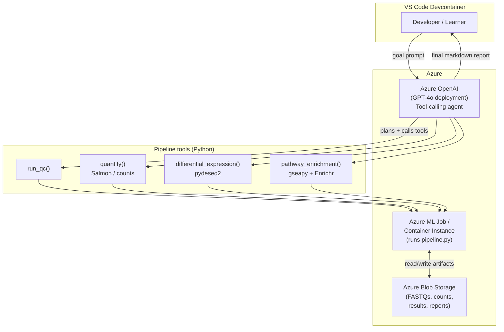

# Scenario 01 — Autonomous Bioinformatics Pipeline Assistant

An LLM agent (Azure OpenAI) that **orchestrates an RNA-seq differential-expression
pipeline** and explains each decision it makes along the way.

The agent plans and drives four stages using the real Azure OpenAI **tool-calling**
loop:

```
QC  →  Quantification (Salmon / provided counts)  →  Differential Expression (pydeseq2)  →  Pathway Enrichment (gseapy / Enrichr)
```

Everything Python-only: differential expression uses **pydeseq2** (no R required),
pathway enrichment uses **gseapy** against **Enrichr**. The lab ships with a
synthetic counts matrix fallback so it runs end-to-end even with no internet.

**Learner stack:** Azure + GitHub + VS Code (devcontainer).

---

## Architecture



The agent (`src/agent.py`) holds the reasoning loop. The deterministic analysis
lives in `src/pipeline.py`. The agent never invents results — each tool actually
runs the corresponding analysis function and returns real numbers back into the
model's context.

---

## Repository layout

```
scenario-01-pipeline-automation/
├── README.md
├── requirements.txt
├── .env.example
├── .devcontainer/
│   └── devcontainer.json
├── .github/workflows/
│   └── ci.yml
├── infra/
│   └── azure-setup.md
├── scripts/
│   └── download_data.py
├── src/
│   ├── agent.py          # Azure OpenAI tool-calling orchestrator
│   └── pipeline.py       # QC + pydeseq2 DE + gseapy enrichment
└── data/                 # created by scripts/download_data.py
```

---

## Prerequisites

- An **Azure subscription**.
- An **Azure OpenAI** resource with a chat model deployment that supports tool
  calling (e.g. `gpt-4o` or `gpt-4o-mini`). Note the **endpoint**, **API key**,
  and **deployment name**.
- (Optional) An **Azure Storage** account for staging FASTQs / results.
- **Python 3.11**.
- **VS Code** with the **Dev Containers** extension.
- **Docker** (Docker Desktop or engine) to build/run the devcontainer.

---

## Step-by-step run guide

1. **Clone the repo**

   ```bash
   git clone <your-fork-url>
   cd scenario-01-pipeline-automation
   ```

2. **Open in the devcontainer.** In VS Code: `F1` → *Dev Containers: Reopen in
   Container*. This builds the Python 3.11 image and installs `requirements.txt`
   automatically (see `.devcontainer/devcontainer.json`).

3. **Configure secrets.** Copy the template and fill in your Azure values:

   ```bash
   cp .env.example .env
   # edit .env: AZURE_OPENAI_ENDPOINT, AZURE_OPENAI_API_KEY, AZURE_OPENAI_DEPLOYMENT
   ```

   `.env` is git-ignored; never commit real keys.

4. **Download the data.** This fetches a small public RNA-seq counts matrix and,
   if there is no internet, generates a tiny synthetic counts CSV so the lab
   still runs:

   ```bash
   python scripts/download_data.py
   ```

   Outputs land in `data/` (`counts.csv`, `coldata.csv`).

5. **Run the agent.** The agent plans the run, calls each pipeline tool, prints
   its reasoning, and emits a final markdown report:

   ```bash
   python src/agent.py
   ```

   To run the deterministic pipeline directly (no LLM), for debugging:

   ```bash
   python src/pipeline.py
   ```

6. **Inspect outputs.** Results are written to `data/results/`:
   - `qc_summary.json` — library sizes, gene/sample counts, low-count flags.
   - `de_results.csv` — pydeseq2 differential-expression table (log2FC, padj).
   - `enrichment.csv` — gseapy/Enrichr pathway terms with adjusted p-values.
   - `report.md` — the agent's final narrative report.

---

## Notes

- The agent requires live Azure OpenAI credentials. The pipeline functions
  (`src/pipeline.py`) run fully offline against the bundled/synthetic data.
- gseapy's Enrichr backend needs internet; `pathway_enrichment()` degrades
  gracefully and reports that enrichment was skipped if Enrichr is unreachable.
- To scale out, push `data/` to Blob storage and run `pipeline.py` as an Azure ML
  job or Container Instance — see `infra/azure-setup.md`.
