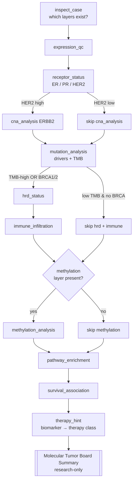

# Lab 1B — Agentic Multi-Omics Tumor Board (Human Breast Cancer)

> ⚠️ **RESEARCH / EDUCATION ONLY — NOT FOR CLINICAL USE.** This lab runs on
> synthetic or public *research* data with deliberately simplified heuristics. It
> must never be used to diagnose, treat, or inform any medical decision. Real
> molecular tumor boards require board-certified clinicians and accredited
> (CAP/CLIA) laboratories.

This is the **harder sequel** to a simple RNA-seq agent lab. The whole point is a
**complex pipeline of many tools where the agent CHOOSES which to run based on the
data** — not a fixed `1 → 2 → 3` sequence. An LLM orchestrator is given **12
analysis "skills"** and must conditionally route through them for each tumor case,
ending with a **Molecular Tumor Board Summary**.

**Stack:** Azure OpenAI (keyless / Azure AD) · GitHub · VS Code dev container ·
Python 3.11.

---

## Why this lab is "agentic" and not a pipeline

A fixed pipeline runs the same steps every time. Here, three different tumors take
three different paths through the toolset because **the agent reasons over each
tool's result before deciding the next call**:

- HER2 looks high → *then* confirm `ERBB2` copy-number; otherwise don't bother.
- High TMB or a BRCA mutation → *then* assess HRD and immune phenotype; otherwise skip.
- Methylation layer missing for this case → *detect that and skip gracefully*.

Two implementations encode the **same** logic so the behaviour is verifiable with
or without Azure:

| Component | File | Needs Azure? | Purpose |
|---|---|---|---|
| LLM agent | `src/agent.py` | yes | Tool-calling loop; the model decides the route. |
| Deterministic router | `src/router.py` | no | Plain if/else twin; pinned by tests. |

---

## Decision-flow diagram



---

## The 12 tools (`src/omics.py`)

Each takes the loaded case dict and returns a JSON-serialisable dict. No randomness,
no network — fully reproducible.

| # | Tool | What it does | Conditional? |
|---|---|---|---|
| 1 | `inspect_case` | Lists which omics layers exist + metadata. | Always (first). |
| 2 | `expression_qc` | QC flags on the expression layer (housekeeping, range). | If expression present. |
| 3 | `receptor_status` | ER/PR/HER2 from ESR1/PGR/ERBB2 → HR±, HER2 high/low. | Always. |
| 4 | `differential_expression` | Tumor-vs-normal top up/down genes. | Optional context. |
| 5 | `cna_analysis(gene)` | GISTIC copy-number state; ERBB2 focal amp. | **Only if HER2 high.** |
| 6 | `mutation_analysis` | Driver mutations (TP53/PIK3CA/BRCA1/2) + TMB (mut/Mb). | Always. |
| 7 | `hrd_status` | HRD call from BRCA1/2 + genomic-scar score. | **Only if TMB-high or BRCA.** |
| 8 | `immune_infiltration` | Cytolytic/IFN-γ signature → hot/cold tumor. | **Only if TMB-high or BRCA.** |
| 9 | `methylation_analysis(gene)` | Promoter methylation. **Layer may be ABSENT.** | **Only if layer present.** |
| 10 | `pathway_enrichment` | Pathways over DE + driver genes. | Optional context. |
| 11 | `survival_association(marker)` | Hazard direction for a marker. | Optional context. |
| 12 | `therapy_hint` | Accumulated findings → actionable biomarker → therapy class. | Always (last). |

---

## The three test cases and their **expected divergent tool paths**

The synthetic generator plants ground truth so routing is reproducible. Case **B**
has **no methylation layer** on purpose, so the agent must detect and skip it.

| Case | Subtype (planted) | Key signals | Expected tool path |
|---|---|---|---|
| **A** `HER2_AMP` | HER2-enriched, HR− | ERBB2 amp+high, **low TMB**, methylation present | `inspect → expression_qc → receptor_status → ` **`cna_analysis`** ` → mutation_analysis → methylation_analysis → pathway_enrichment → survival_association → therapy_hint` |
| **B** `TNBC_BRCA` | Basal / triple-negative | **BRCA1 pathogenic**, **HIGH TMB**, immune-hot, **methylation ABSENT** | `inspect → expression_qc → receptor_status → mutation_analysis → ` **`hrd_status → immune_infiltration`** ` → pathway_enrichment → survival_association → therapy_hint` |
| **C** `LUMINAL_A` | Luminal A, HR+ | ESR1/PGR high, low TMB, no ERBB2 amp, methylation present | `inspect → expression_qc → receptor_status → mutation_analysis → methylation_analysis → pathway_enrichment → survival_association → therapy_hint` |

**Where they diverge (this is the whole point):**

| Step | Case A | Case B | Case C |
|---|---|---|---|
| `cna_analysis(ERBB2)` | ✅ run (HER2 high) | ⛔ skip | ⛔ skip |
| `hrd_status` + `immune_infiltration` | ⛔ skip (low TMB) | ✅ run (TMB-high + BRCA) | ⛔ skip |
| `methylation_analysis` | ✅ run (present) | ⛔ skip (layer absent) | ✅ run (present) |
| `therapy_hint` →  | anti-HER2 | PARP + immunotherapy | endocrine therapy |

`tests/test_router.py` asserts these three paths are pairwise distinct and match
the expected lists exactly.

---

## Data

- **Real source:** [cBioPortal](https://www.cbioportal.org/api) public REST API,
  study `brca_tcga_pan_can_atlas_2018` (public, **no API key**). `download_data.py`
  can pull mRNA expression, somatic mutations, GISTIC copy-number, and clinical for
  a gene panel and a few samples (`--source cbioportal` / `--source auto`).
- **Offline deterministic fallback (default):** a synthetic generator builds the
  three planted cases above, so the lab — and CI — run with **no internet**.

```bash
python scripts/download_data.py                 # synthetic (deterministic) [default]
python scripts/download_data.py --source auto    # try cBioPortal, else synthetic
python scripts/download_data.py --source cbioportal --n-samples 3
```

Output: `data/case_A.json`, `data/case_B.json`, `data/case_C.json`, `data/manifest.json`.

---

## Run guide (Azure + GitHub + VS Code)

### A. Open in VS Code

1. `git clone` your fork, then **Reopen in Container** (uses `.devcontainer/`,
   Python 3.11, installs `requirements.txt`).

### B. Provision keyless Azure OpenAI

Follow **[`infra/azure-setup.md`](infra/azure-setup.md)**: create the resource,
deploy a tool-calling model (e.g. `gpt-4o`), and grant your identity the
**Cognitive Services OpenAI User** role. Then `az login`.

### C. Configure `.env`

```bash
cp .env.example .env
# set AZURE_OPENAI_ENDPOINT and AZURE_OPENAI_DEPLOYMENT; leave AZURE_OPENAI_API_KEY blank
```

Leaving the key blank triggers keyless Azure AD auth in `src/agent.py`:

```python
from azure.identity import DefaultAzureCredential, get_bearer_token_provider
token_provider = get_bearer_token_provider(
    DefaultAzureCredential(exclude_managed_identity_credential=True),
    "https://cognitiveservices.azure.com/.default",
)
AzureOpenAI(azure_endpoint=ENDPOINT, azure_ad_token_provider=token_provider,
            api_version=API_VERSION)
```

### D. Generate data and run

```bash
python scripts/download_data.py            # writes the 3 cases
python scripts/run_cases.py                # LLM agent on A, B, C — prints each tool path
python src/agent.py data/case_B.json       # one case → output/reports/summary_case_B.md
```

### E. Verify the conditional behaviour WITHOUT Azure

```bash
python scripts/run_cases.py --router-only  # deterministic paths, no creds
python -m pytest tests/test_router.py -v    # asserts the 3 paths diverge as expected
```

---

## Repository layout

```
scenario-01b-multiomics-cancer/
├── README.md
├── requirements.txt
├── pyproject.toml                # ruff + pytest config
├── .env.example                  # keyless-first config
├── .gitignore
├── .devcontainer/devcontainer.json
├── .github/workflows/ci.yml      # ruff + smoke import + router tests (no secrets)
├── infra/azure-setup.md          # az CLI: resource, deployment, role assignment
├── data/                         # generated case_A|B|C.json (git-ignored)
├── scripts/
│   ├── download_data.py          # cBioPortal REST + synthetic planted fallback
│   └── run_cases.py              # run agent on A/B/C, print divergent tool paths
├── src/
│   ├── __init__.py
│   ├── omics.py                  # the 12 deterministic skills
│   ├── router.py                 # non-LLM if/else twin of the agent's routing
│   └── agent.py                  # Azure OpenAI tool-calling loop (keyless)
└── tests/
    └── test_router.py            # proves A/B/C take different, expected paths
```

---

## Disclaimer (again, on purpose)

This material is for **research and education only**. The biomarker→therapy-class
associations emitted by `therapy_hint` are illustrative teaching mappings, **not**
treatment recommendations. Do not use any output of this lab for clinical care.
