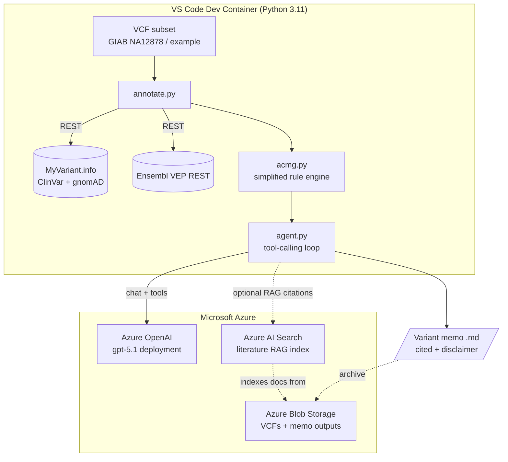

# Scenario 02 — Variant Interpretation Assistant

> ⚠️ **RESEARCH / EDUCATION ONLY — NOT FOR CLINICAL USE.**
> This lab is a teaching tool. The annotations, ACMG/AMP heuristics, and
> LLM-generated memos are a **simplified educational subset** and **must not**
> be used to diagnose, treat, or make any clinical or medical decision about a
> real person. Clinical variant interpretation requires a qualified molecular
> geneticist / clinical laboratory operating under CAP/CLIA (or local
> equivalent) using the full ACMG/AMP 2015 framework and curated evidence.

A runnable training lab that:

1. Parses a small **VCF** (Genome in a Bottle NA12878 / HG001 subset, or a
   bundled example with well-known variants such as *BRCA1*).
2. **Annotates** each variant against real public knowledgebases —
   [MyVariant.info](https://myvariant.info) (no API key) and the
   [Ensembl VEP REST API](https://rest.ensembl.org) — collecting **ClinVar**
   clinical significance and **gnomAD** allele frequency.
3. Applies a **transparent, simplified ACMG/AMP rule engine** (a few criteria:
   PVS1 / PM2 / PP3 / BA1 / BS1 heuristics) to produce a classification with a
   written rationale.
4. Uses an **Azure OpenAI tool-calling agent** to weave the structured evidence
   into a cited, human-readable **variant-interpretation memo** — always ending
   with the research-only disclaimer.

---

## Architecture



- **Azure OpenAI** runs the reasoning + tool-calling loop.
- **Azure AI Search** (optional) provides a literature-RAG index so the agent
  can cite supporting publications/guidelines stored in **Blob Storage**.
- **GitHub Actions** lints the code and runs a smoke import on every push.

---

## Prerequisites

- [VS Code](https://code.visualstudio.com/) + the **Dev Containers** extension
  (or GitHub Codespaces).
- Docker (for the dev container) **or** a local Python 3.11 environment.
- An **Azure subscription** with access to **Azure OpenAI** (a tool-calling chat
  deployment, e.g. `gpt-5.1`). Keyless **Microsoft Entra ID** auth is used by
  default (`az login`; no API key in the repo). Azure AI Search is **optional**
  (RAG citations).
- The [Azure CLI](https://learn.microsoft.com/cli/azure/) (`az`) for the infra
  steps — see [`infra/azure-setup.md`](infra/azure-setup.md).
- Internet access at runtime (the annotation step calls public REST APIs).

---

## Step-by-step run guide

1. **Open in the dev container.** `File ▸ Open Folder…`, then
   *"Reopen in Container"*. This builds the Python 3.11 image and installs
   `requirements.txt` automatically.

2. **(Local Python alternative)** Create and populate a virtualenv:
   ```bash
   python -m venv .venv && source .venv/bin/activate
   pip install -r requirements.txt
   ```

3. **Provision Azure resources** (one-time). Follow
   [`infra/azure-setup.md`](infra/azure-setup.md) to create Azure OpenAI,
   optionally Azure AI Search, and a Storage account.

4. **Configure Azure & sign in.** Copy the template, set your endpoint +
   deployment, then sign in for keyless auth (no API key needed):
   ```bash
   cp .env.example .env
   # edit .env: AZURE_OPENAI_ENDPOINT, AZURE_OPENAI_DEPLOYMENT
   az login   # keyless Microsoft Entra ID (DefaultAzureCredential)
   ```

5. **Get data.** A tiny example VCF is bundled at `data/example.vcf`. To pull a
   real public subset (GIAB / 1000 Genomes), run:
   ```bash
   python scripts/download_data.py            # writes data/giab_subset.vcf
   python scripts/download_data.py --list     # just print the source URLs
   ```

6. **Annotate the VCF** (calls MyVariant.info / VEP):
   ```bash
   python src/annotate.py data/example.vcf --out data/annotated.json
   ```

7. **Run the ACMG rule engine** on the annotations:
   ```bash
   python src/acmg.py data/annotated.json
   ```

8. **Generate the interpretation memos** with the Azure OpenAI agent:
   ```bash
   python src/agent.py data/example.vcf --out-dir output/memos
   ```
   One `*.md` memo is written per variant, each citing its data sources and
   ending with the research-only disclaimer.

---

## Layout

| Path | Purpose |
|------|---------|
| `src/annotate.py` | VCF parsing + MyVariant.info / VEP annotation |
| `src/acmg.py`     | Simplified, transparent ACMG/AMP rule engine |
| `src/agent.py`    | Azure OpenAI tool-calling agent → memo writer |
| `scripts/download_data.py` | Fetch a public VCF subset (+ bundled example) |
| `data/example.vcf` | Bundled tiny VCF (BRCA1 & friends) |
| `infra/azure-setup.md` | `az` CLI provisioning recipe |
| `.devcontainer/`  | Python 3.11 dev container |
| `.github/workflows/ci.yml` | ruff lint + smoke import |

---

## Data sources & licenses

- **MyVariant.info** — aggregates ClinVar, gnomAD, dbNSFP, and more. Free,
  no key. Cite the underlying sources (ClinVar, gnomAD) in any output.
- **Ensembl VEP REST** — variant effect predictions; Ensembl is open data.
- **Genome in a Bottle (NA12878 / HG001)** — NIST reference material, public.
- **1000 Genomes** — open-access genotype data.

Respect each provider's rate limits and terms of use.

---

> ⚠️ **Reminder:** research/education only. Not a medical device. Not for
> clinical use. No warranty.
