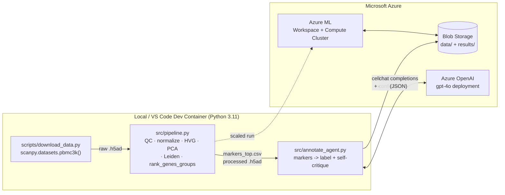

# Scenario 03 — Single-Cell Analysis Agent

A runnable training lab: a **Scanpy** single-cell RNA-seq pipeline
(QC → normalization → clustering → marker genes) where an **Azure OpenAI** agent
performs marker-gene-based **cell-type annotation** in the style of
[GPTCelltype](https://github.com/Winnie09/GPTCelltype) (markers → GPT → label),
with a cautious **self-critique** pass that flags ambiguous clusters
(e.g. cycling vs. exhausted T cells).

**Dataset:** 10x Genomics **PBMC 3k** — ~2,700 peripheral blood mononuclear cells,
the classic Scanpy clustering tutorial dataset.

**Stack:** Azure (Azure ML compute + Azure OpenAI + Blob) · GitHub · VS Code Dev Containers.

---

## Architecture



The pipeline runs locally in the dev container for the lab, or is submitted to an
**Azure ML compute cluster** for larger datasets. Data and results stage through
the workspace's **Blob Storage**. The annotation agent calls an **Azure OpenAI**
chat deployment.

---

## Prerequisites

- **Docker** + **VS Code** with the *Dev Containers* extension (or local Python 3.11).
- An **Azure subscription** with access to **Azure OpenAI** (approved).
- **Azure CLI** (`az`) for provisioning — see [`infra/azure-setup.md`](infra/azure-setup.md).
- An Azure OpenAI **chat model deployment** (e.g. `gpt-4o`).
- Internet access on first run (to download PBMC3k and Python wheels).

---

## Repository layout

```
.
├── README.md
├── requirements.txt
├── .env.example                 # copy to .env and fill in Azure OpenAI vars
├── .devcontainer/
│   └── devcontainer.json        # Python 3.11 dev container
├── scripts/
│   └── download_data.py         # PBMC3k via Scanpy (+ manual 10x fallback)
├── src/
│   ├── pipeline.py              # Scanpy QC -> clustering -> markers
│   └── annotate_agent.py        # Azure OpenAI annotation + self-critique
├── infra/
│   └── azure-setup.md           # az CLI: Azure ML + compute + Azure OpenAI
└── .github/workflows/
    └── ci.yml                   # ruff lint + smoke import
```

---

## Step-by-step run guide

1. **Open in the dev container.** In VS Code: *Dev Containers: Reopen in Container*.
   This builds the Python 3.11 image and runs `pip install -r requirements.txt`.
   (Without the container, run `pip install -r requirements.txt` in a Python 3.11 venv.)

2. **Provision Azure resources.** Follow [`infra/azure-setup.md`](infra/azure-setup.md)
   to create the Azure ML workspace + compute and an Azure OpenAI `gpt-4o` deployment.
   Note the endpoint, key, and deployment name.

3. **Configure secrets.** Copy the env template and fill in your values:
   ```bash
   cp .env.example .env
   # edit .env: AZURE_OPENAI_ENDPOINT, AZURE_OPENAI_DEPLOYMENT, AZURE_OPENAI_API_KEY
   ```

4. **Download the data.**
   ```bash
   python scripts/download_data.py
   ```
   Writes `data/pbmc3k_raw.h5ad` (uses `scanpy.datasets.pbmc3k()`, with a manual
   10x URL fallback if the loader is offline).

5. **Run the Scanpy pipeline.**
   ```bash
   python src/pipeline.py
   ```
   Produces `results/pbmc3k_processed.h5ad`, `results/markers_top.csv`, and
   `results/umap_leiden.png`.

6. **Run the annotation agent.**
   ```bash
   python src/annotate_agent.py
   ```
   Sends the top markers per cluster to Azure OpenAI and writes
   `results/cell_type_annotations.csv` with a **cell-type label, confidence, and
   one-line justification** per cluster, plus **ambiguity flags** from the
   self-critique pass.

7. **Review flagged clusters.** Open `results/cell_type_annotations.csv` and focus
   on rows where `ambiguous = True` — these are where the agent is least certain
   (e.g. cycling vs. exhausted, monocyte vs. dendritic) and warrant a human check
   against the markers and the UMAP plot.

---

## How the annotation agent works (GPTCelltype-style)

1. `pipeline.py` runs `sc.tl.rank_genes_groups` (Wilcoxon) to get the top
   differentially-expressed markers per Leiden cluster.
2. `annotate_agent.py` sends the top ~10 markers per cluster to the Azure OpenAI
   chat deployment with `temperature=0` and a strict JSON schema, asking for a
   PBMC cell-type label + confidence + justification.
3. A **self-critique** second pass re-reads the labels against their markers and
   flags genuinely ambiguous clusters, suggesting an alternative cell type.

This keeps a human in the loop precisely where LLM annotation is most likely to be
confidently wrong.

---

## Notes & caveats

- LLM annotations are a **first-pass hypothesis**, not ground truth. Cross-check
  with a reference-based method (e.g. `celltypist`, included in `requirements.txt`)
  and canonical marker panels.
- Results vary with model version and marker selection; pin both for reproducibility.
- CI (`.github/workflows/ci.yml`) only lints and smoke-imports — it does not call
  Azure or download data.
