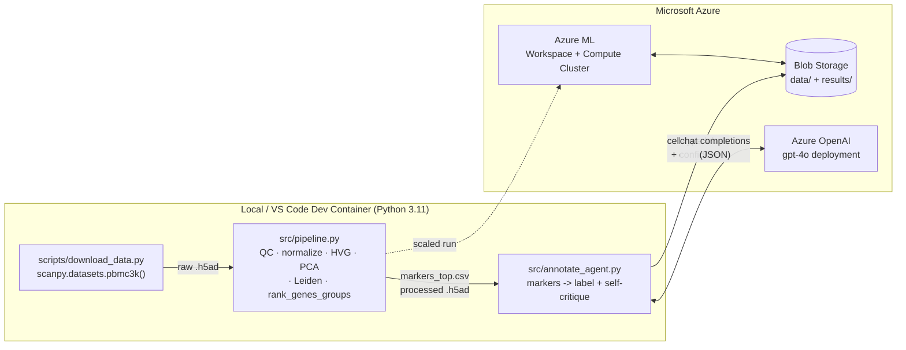

# Scenario 03 — Single-Cell Analysis Agent

A runnable training lab: a **Scanpy** single-cell RNA-seq pipeline
(QC → normalization → clustering → marker genes) where an **Azure OpenAI** agent
performs marker-gene-based **cell-type annotation** in the style of
[GPTCelltype](https://github.com/Winnie09/GPTCelltype) (markers → GPT → label),
with a cautious **self-critique** pass that flags ambiguous clusters
(e.g. cycling vs. exhausted T cells), plus a **cross-readout disagreement** pass that flags gene programs whose disease/state signal is significant by *intensity* (mean score per cell) or *prevalence* (fraction of cells in the state) but not both -- the "both answers are defensible" failure class.

**Dataset:** 10x Genomics **PBMC 3k** — ~2,700 peripheral blood mononuclear cells,
the classic Scanpy clustering tutorial dataset. At runtime you can instead pick a
**complex profile** (`Kang et al. 2018 IFN-beta PBMC`, ~24,700 cells, `ctrl` vs
`stim`), a two-condition dataset used to stress-test the cross-readout
disagreement check (see below).

**Stack:** Azure (Azure ML compute + Azure OpenAI + Blob) · GitHub · VS Code Dev Containers.

---

## Architecture


```mermaid
flowchart LR
    subgraph Dev["Local / VS Code Dev Container (Python 3.11)"]
        DL["scripts/download_data.py<br/>scanpy.datasets.pbmc3k()"]
        PIPE["src/pipeline.py<br/>QC · normalize · HVG · PCA<br/>· Leiden · rank_genes_groups"]
        AGENT["src/annotate_agent.py<br/>markers -> label + self-critique"]
    end

    subgraph Azure["Microsoft Azure"]
        BLOB[("Blob Storage<br/>data/ + results/")]
        AML["Azure ML<br/>Workspace + Compute Cluster"]
        AOAI["Azure OpenAI<br/>gpt-4o deployment"]
    end

    DL -->|raw .h5ad| PIPE
    PIPE -->|markers_top.csv<br/>processed .h5ad| AGENT
    AGENT -->|cell-type labels<br/>+ confidence| BLOB

    PIPE -. "scaled run" .-> AML
    AML <--> BLOB
    AGENT <-->|"chat completions<br/>(JSON)"| AOAI
```

The pipeline runs locally in the dev container for the lab, or is submitted to an
**Azure ML compute cluster** for larger datasets. Data and results stage through
the workspace's **Blob Storage**. The annotation agent calls an **Azure OpenAI**
chat deployment.

---

## Prerequisites

- **Docker** + **VS Code** with the *Dev Containers* extension (or local Python 3.11).
- An **Azure subscription** with access to **Azure OpenAI** (approved).
- **Azure CLI** (`az`) for provisioning — see [`infra/azure-setup.md`](infra/azure-setup.md).
- An Azure OpenAI **chat model deployment** (e.g. `gpt-4o`).
- Internet access on first run (to download PBMC3k and Python wheels).

> **Platform note (x64 required for the Scanpy stack).** `requirements.txt` targets
> **Python 3.11 on x64** (`win_amd64`) or **Linux x86_64**. The single-cell stack has
> **no wheels for Windows on ARM64** (`win_arm64`): `numba`, `llvmlite`, `statsmodels`,
> `tables` (PyTables) and `leidenalg` are unavailable there, and `numba` is a required
> dependency of `scanpy`, so `pip install -r requirements.txt` fails to resolve.
> On an **ARM64 Windows** machine, either use the **Dev Container** (Linux x86_64) or
> install the **x64 build of Python 3.11** (it runs under emulation) — see below.

---

## Repository layout

```
.
├── README.md
├── requirements.txt
├── .env.example                 # copy to .env and fill in Azure OpenAI vars
├── .devcontainer/
│   └── devcontainer.json        # Python 3.11 dev container
├── scripts/
│   └── download_data.py         # PBMC3k via Scanpy (+ manual 10x fallback)
├── src/
│   ├── pipeline.py              # Scanpy QC -> clustering -> markers
│   └── annotate_agent.py        # Azure OpenAI annotation + self-critique
├── infra/
│   └── azure-setup.md           # az CLI: Azure ML + compute + Azure OpenAI
├── examples/
│   ├── report.md                # example PI-style summary (committed output)
│   ├── agent_report_simple.md   # example agent report -- simple PBMC3k run
│   ├── agent_report_complex.md  # example agent report -- complex Kang 2018 run
│   ├── umap_leiden_simple.png   # example clustering UMAP -- simple PBMC3k
│   ├── umap_leiden_complex.png  # example clustering UMAP -- complex Kang 2018
│   ├── umap_celltype_simple.png # example cell-type UMAP -- simple PBMC3k
│   └── umap_celltype_complex.png # example cell-type UMAP -- complex Kang 2018
└── .github/workflows/
    └── ci.yml                   # ruff lint + smoke import
```

---

## Step-by-step run guide

1. **Open in the dev container.** In VS Code: *Dev Containers: Reopen in Container*.
   This builds the Python 3.11 image and runs `pip install -r requirements.txt`.
   (Without the container, run `pip install -r requirements.txt` in a Python 3.11 venv.)

   **On Windows (local venv, x64 Python 3.11):**
   ```powershell
   # Confirm an x64 (AMD64) Python 3.11 is installed:
   py -3.11 -c "import platform; print(platform.python_version(), platform.machine())"
   # Expect: 3.11.x  AMD64   (NOT ARM64 — the Scanpy stack has no ARM64 wheels)

   py -3.11 -m venv .venv
   .\.venv\Scripts\python.exe -m pip install --upgrade pip
   .\.venv\Scripts\python.exe -m pip install -r requirements.txt
   ```
   If `machine()` reports `ARM64`, install the **x64** Python 3.11 build from
   python.org (it runs under emulation on Windows on ARM) or use the Dev Container.

   > **Calling the venv Python directly** (`.\.venv\Scripts\python.exe ...`) is the
   > most reliable way on Windows and is used throughout this guide. If you prefer
   > to *activate* the venv with `.\.venv\Scripts\Activate.ps1` and it fails with
   > *"running scripts is disabled on this system"*, allow it once per user:
   > `Set-ExecutionPolicy -Scope CurrentUser RemoteSigned`. A bare `python` may
   > otherwise resolve to a different global interpreter that lacks these packages.

2. **Provision Azure resources.** Follow [`infra/azure-setup.md`](infra/azure-setup.md)
   to create the Azure ML workspace + compute and an Azure OpenAI `gpt-4o` deployment.
   Note the endpoint, key, and deployment name.

3. **Configure secrets.** Copy the env template and fill in your values:
   ```bash
   cp .env.example .env
   # edit .env: AZURE_OPENAI_ENDPOINT, AZURE_OPENAI_DEPLOYMENT, AZURE_OPENAI_API_KEY
   ```

4. **Download the data.** The script prompts at the very beginning for a dataset
   profile (with a short description of each), or pass `--dataset` to skip it:
   ```bash
   python scripts/download_data.py                 # interactive prompt
   python scripts/download_data.py --dataset simple
   python scripts/download_data.py --dataset complex
   ```
   - **simple** -- 10x **PBMC 3k** (~2,700 cells, one healthy donor, single
     condition). Clean, fast baseline. Writes `data/pbmc3k_raw.h5ad` (uses
     `scanpy.datasets.pbmc3k()`, with a manual 10x URL fallback if offline).
   - **complex** -- **Kang et al. 2018 IFN-beta PBMC** (~24,700 cells, `ctrl` vs
     `stim`, 8 cell types). Interferon stimulation drives strong, cell-type-
     specific responses, so the same program often changes in **intensity** (per
     cell) or **prevalence** (fraction of cells) but not both -- the exact
     disagreement class the agent's cross-readout check is built to catch. Writes
     `data/kang2018_raw.h5ad` (downloaded from the scverse example-data host).

   The pipeline and agent read whichever profile you select at their own prompts
   (or via `--dataset`), so make sure you download the matching dataset first.

5. **Run the Scanpy pipeline.**
   ```bash
   python src/pipeline.py
   ```
   The script first prompts for a **dataset profile** (1 = simple PBMC3k, 2 =
   complex Kang 2018 IFN-beta) and a **run mode** (1 = fixed resolution, 2 = the
   agent iterates resolutions). You can skip the prompts non-interactively:
   ```bash
   python src/pipeline.py --dataset simple --mode 1
   python src/pipeline.py --dataset complex --mode 2 --iterations 10
   ```
   Produces `results/pbmc3k_processed.h5ad`, `results/markers_top.csv`,
   `results/program_contrasts.csv` (per-cluster **intensity vs prevalence**
   program tests), `results/run_metadata.json`, and
   `results/umap_leiden.png` (takes ~1–2 min; yields 9 Leiden clusters on PBMC3k).

   > On Windows you may see a few `ValueError: high is out of bounds for int32`
   > lines tagged `Exception ignored in:` at the very end. These are a harmless
   > shutdown-time warning from the `leiden`/`umap` native RNG cleanup — the run
   > still exits 0 and all outputs are written correctly.

6. **Run the annotation agent.** *(requires the Azure OpenAI setup from steps 2–3)*
   ```bash
   python src/annotate_agent.py
   ```
   Sends the top markers per cluster to Azure OpenAI and writes
   `results/cell_type_annotations.csv` with a **cell-type label, confidence, and
   one-line justification** per cluster, plus **ambiguity flags** from the
   self-critique pass. A third **cross-readout disagreement** pass reads
   `program_contrasts.csv` and flags programs that are significant by *intensity*
   or *prevalence* but not both; the agent weighs in on each discordant contrast
   and writes `results/cross_readout_disagreements.csv` and a human-readable
   `results/agent_report.md`. The report is **advisory only** -- the final call on
   every ambiguous or discordant result stays with the researcher. It also renders `results/umap_celltype.png` — the UMAP
   coloured by the assigned **cell types** (a companion to the pipeline's
   `umap_leiden.png`, which is coloured by cluster number). Without a configured
   `.env`, this step stops with a clear message telling you which variables to set.

7. **Review flagged clusters.** Open `results/cell_type_annotations.csv` and focus
   on rows where `ambiguous = True` — these are where the agent is least certain
   (e.g. cycling vs. exhausted, monocyte vs. dendritic) and warrant a human check
   against the markers and the UMAP plot.

---

## How the annotation agent works (GPTCelltype-style)

1. `pipeline.py` runs `sc.tl.rank_genes_groups` (Wilcoxon) to get the top
   differentially-expressed markers per Leiden cluster.
2. `annotate_agent.py` sends the top ~10 markers per cluster to the Azure OpenAI
   chat deployment with `temperature=0` and a strict JSON schema, asking for a
   PBMC cell-type label + confidence + justification.
3. A **self-critique** second pass re-reads the labels against their markers and
   flags genuinely ambiguous clusters, suggesting an alternative cell type.
4. A **cross-readout disagreement** third pass compares two defensible readouts of
   each gene program -- *intensity* (mean score per cell) and *prevalence* (fraction
   of cells above a shared null threshold). Contrasts significant by exactly one
   readout are flagged as ambiguous (both answers are internally consistent), the
   agent recommends a concrete next step per contrast, and the researcher makes the
   final call.

This keeps a human in the loop precisely where LLM annotation is most likely to be
confidently wrong.

---

## Notes & caveats

- LLM annotations are a **first-pass hypothesis**, not ground truth. Cross-check
  with a reference-based method (e.g. `celltypist`, included in `requirements.txt`)
  and canonical marker panels.
- Results vary with model version and marker selection; pin both for reproducibility.
- CI (`.github/workflows/ci.yml`) only lints and smoke-imports — it does not call
  Azure or download data.
- **Windows on ARM64 is unsupported for the Scanpy stack.** `numba`, `llvmlite`,
  `statsmodels`, `tables` and `leidenalg` publish no `win_arm64` wheels, so install
  fails there. Use the Dev Container or an **x64** Python 3.11 (see the run guide).


