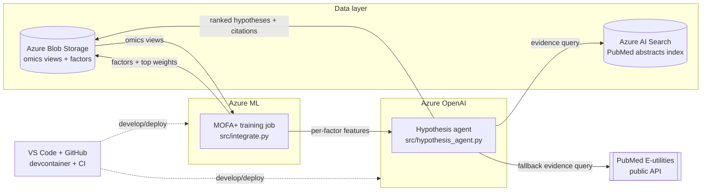

# Scenario 04 — Multi-omics Hypothesis Generation (MOFA+ + LLM agent)

Integrate multiple omics layers with **MOFA+** (Multi-Omics Factor Analysis),
then use an **Azure OpenAI** reasoning agent to interpret the latent factors,
connect the top-weighted features to biology, optionally pull supporting /
contradicting literature (PubMed E-utilities), and emit a **ranked list of
candidate-driver hypotheses** — each one traceable back to the data (which
factor, which feature, what weight).

> ⚠️ **Epistemic guardrail.** MOFA+ factors capture *covariation* across omics
> layers. Covariation is **not** causation. Every hypothesis the agent produces
> is explicitly labelled as a hypothesis with caveats and a data citation. The
> lab is a *hypothesis-generation* tool, not a discovery-validation tool.

---

## Dataset

The reference dataset is the **MOFA+ CLL** (chronic lymphocytic leukaemia)
multi-omics tutorial dataset that ships with the `MOFA2` / `mofapy2` tutorials.
It contains four views for ~200 patients:

| View          | Modality                  | Features (approx) |
|---------------|---------------------------|-------------------|
| `mRNA`        | RNA-seq expression        | 5000              |
| `Methylation` | DNA methylation (M-values)| 4248              |
| `Drugs`       | ex-vivo drug response     | 310               |
| `Mutations`   | somatic mutations (binary)| 69                |

- Public reference: <https://muon-tutorials.readthedocs.io/en/latest/CLL.html>
- Original paper: Dietrich et al., *J Clin Invest* 2018 (PACE / CLL cohort).

Because this container has **no internet**, `scripts/download_data.py` also
generates a small **synthetic** multi-omics dataset with the same four-view
shape, so the whole pipeline runs offline. `src/integrate.py` falls back to the
synthetic generator automatically when the real data file is absent.

---

## Architecture



- **Azure ML** runs the MOFA+ integration job (`src/integrate.py`).
- **Azure Blob Storage** holds the raw omics views and the trained factors /
  weights.
- **Azure OpenAI** hosts the chat model that drives the hypothesis agent.
- **Azure AI Search** (optional) indexes PubMed abstracts for fast in-tenant
  evidence retrieval; when it is not configured the agent falls back to the
  public **PubMed E-utilities** API.
- **GitHub + VS Code** provide the dev loop (devcontainer + CI).

---

## Prerequisites

- Python 3.11 (provided by the devcontainer).
- An Azure subscription with:
  - **Azure OpenAI** resource + a deployed chat model (e.g. `gpt-4o`).
  - *(optional)* **Azure AI Search** service with a PubMed abstracts index.
  - *(optional)* **Azure ML** workspace if you want to run training as a job.
- `az` CLI (for the infra steps in `infra/azure-setup.md`).
- The repo opened in VS Code with the **Dev Containers** extension, or any
  Python 3.11 virtualenv.

---

## Step-by-step run guide

1. **Open the devcontainer.** In VS Code: *Dev Containers: Reopen in Container*.
   This builds Python 3.11 and installs `requirements.txt`.

2. **Configure secrets.** Copy `.env.example` to `.env` and fill in your Azure
   OpenAI endpoint, key, and deployment name. Azure AI Search vars are optional.
   ```bash
   cp .env.example .env
   # edit .env
   ```

3. **Get the data.** Fetch the real CLL dataset (needs internet) or generate the
   synthetic fallback (always works):
   ```bash
   python scripts/download_data.py            # tries real download, else synthetic
   python scripts/download_data.py --synthetic # force synthetic
   ```
   Output lands in `data/`.

4. **Run the integration.** Train MOFA+ and extract factors + top feature
   weights per factor:
   ```bash
   python src/integrate.py
   ```
   This writes `data/factors.csv`, `data/weights/<view>.csv`, and a tidy
   `data/top_features_per_factor.json` consumed by the agent.

5. **Generate hypotheses.** Run the Azure OpenAI agent over the per-factor top
   features. It ranks candidate drivers, scores evidence strength, and cites the
   exact factor + feature weight behind each claim:
   ```bash
   python src/hypothesis_agent.py
   ```
   Output: `output/hypotheses.json` and a human-readable `output/hypotheses.md`.

6. **(Optional) Run in Azure.** Follow `infra/azure-setup.md` to provision the
   Azure ML workspace, Azure OpenAI deployment, and Azure AI Search index, then
   submit `src/integrate.py` as an Azure ML job and point the agent at your
   Search index.

7. **CI.** `.github/workflows/ci.yml` runs `ruff` lint + a smoke import on every
   push.

---

## Layout

```
scenario-04-multiomics-hypothesis/
├── README.md
├── requirements.txt
├── .env.example
├── .devcontainer/devcontainer.json
├── .github/workflows/ci.yml
├── infra/azure-setup.md
├── scripts/download_data.py
└── src/
    ├── integrate.py
    └── hypothesis_agent.py
```
