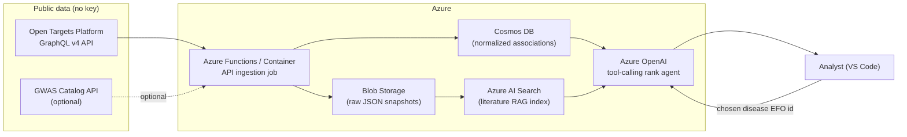

# Scenario 05 — Drug-Target Discovery from Human Genetics

A runnable training lab that queries the **public Open Targets Platform GraphQL API**
for target–disease association evidence (genetic association, eQTL/colocalization,
known drugs, tractability, safety), then uses an **Azure OpenAI tool-calling agent** to
rank and explain prioritized drug targets for a chosen disease — citing each evidence
type and an explicit transparency caveat that *human genetic support ≠ guaranteed
clinical efficacy*.

**Worked example disease:** Type 2 diabetes mellitus — EFO id `EFO_0001360`.

---

## What you build

1. A thin Open Targets client (`src/opentargets.py`) that runs real v4 GraphQL queries
   for a disease's associated targets, per-datatype association scores, target
   tractability, and known safety liabilities.
2. A download script (`scripts/download_data.py`) that snapshots the associations to
   `data/associations_EFO_0001360.json`, with a small bundled fallback so the lab runs
   offline.
3. An Azure OpenAI agent (`src/rank_agent.py`) that calls the client as a *tool*, scores
   each candidate target across four transparent axes (human genetic support, tissue
   specificity, tractability, safety), and emits a markdown **target-prioritization
   memo**.

---

## Architecture



In this lab the ingestion job and Cosmos/Blob are represented locally by
`scripts/download_data.py` writing into `data/`. The agent reads that snapshot (or live
API) and produces the memo. The Azure AI Search literature-RAG leg is wired in the infra
docs and left as an optional extension — the agent already cites evidence *types*
returned by Open Targets.

---

## Prerequisites

- Python 3.11 (a devcontainer is provided under `.devcontainer/`).
- An Azure OpenAI resource with a deployed chat model that supports tool calling
  (e.g. `gpt-4o` or `gpt-4o-mini`). Copy `.env.example` to `.env` and fill in values.
- Internet access for the *live* path. The lab also ships an offline fallback snapshot,
  so the ranking step runs even without network.
- No API key is needed for Open Targets — it is fully public.

---

## Step-by-step run guide

1. **Open the folder** in VS Code and reopen in the devcontainer (or create a local venv
   with Python 3.11).

2. **Install dependencies** (in an environment with internet):

   ```bash
   pip install -r requirements.txt
   ```

3. **Configure Azure OpenAI.** Copy the example env file and edit it:

   ```bash
   cp .env.example .env
   # then set AZURE_OPENAI_ENDPOINT, AZURE_OPENAI_API_KEY, AZURE_OPENAI_DEPLOYMENT
   ```

4. **Smoke-test the Open Targets client** (live API, no key required):

   ```bash
   python -m src.opentargets EFO_0001360
   ```

   You should see the top associated targets for type 2 diabetes with per-datatype
   scores printed.

5. **Snapshot the data** for the worked example into `data/`:

   ```bash
   python scripts/download_data.py --efo EFO_0001360 --size 25
   ```

   This writes `data/associations_EFO_0001360.json`. If the API is unreachable, the
   script falls back to the bundled snapshot so later steps still work.

6. **Run the ranking agent** to produce the prioritization memo:

   ```bash
   python -m src.rank_agent --efo EFO_0001360 --top 10 --out memo_EFO_0001360.md
   ```

   The agent pulls evidence via its Open Targets tool, scores each target across the four
   axes, and writes a markdown memo. Open `memo_EFO_0001360.md` to review.

7. **(Optional) Pick another disease.** Find an EFO id at
   <https://platform.opentargets.org> (search a disease, copy the `EFO_...` id from the
   URL) and re-run steps 5–6 with the new id.

8. **(Optional) Stand up the Azure backing services** using `infra/azure-setup.md` to run
   ingestion as a Function/Container and add the Azure AI Search literature RAG index.

---

## Interpreting the memo

The memo ranks targets but is explicit that **genetic association is supporting evidence,
not proof of efficacy**. Use it to *triage* hypotheses for wet-lab / literature
follow-up, not to make go/no-go decisions on its own. Tractability tells you whether a
target is *druggable*; safety flags surface known liabilities; tissue/eQTL specificity
hints at mechanism. None of these guarantees a successful drug.

---

## Files

| Path | Purpose |
|------|---------|
| `src/opentargets.py` | Open Targets GraphQL v4 client (associations, tractability, safety). |
| `src/rank_agent.py` | Azure OpenAI tool-calling agent → prioritization memo. |
| `scripts/download_data.py` | Snapshot associations to `data/`, with offline fallback. |
| `infra/azure-setup.md` | az CLI for Azure OpenAI + AI Search + Function/Container. |
| `.github/workflows/ci.yml` | ruff lint + smoke import. |
| `.devcontainer/devcontainer.json` | Python 3.11 dev environment. |

---

## Disclaimer

Educational lab. Open Targets data is licensed CC0/CC-BY per their terms; review the
[Open Targets license](https://platform-docs.opentargets.org/licence) before downstream
use. This lab does not provide medical advice.
